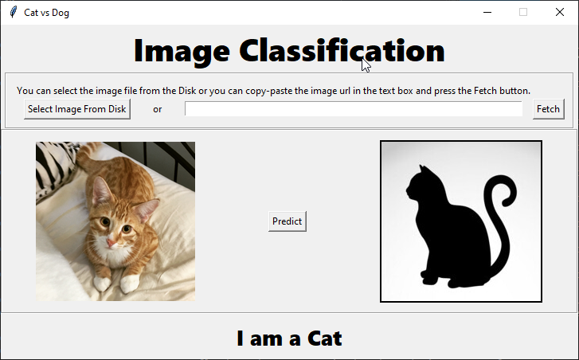

# Image-Classification-using-Keras
  Classify image as cat or dog using Convolutional Neural Network. I have also developed a software for testing the model.

# Description

  First I have created a CNN model with keras which contains,
  
1. Input layer of size 64x64.

2. Convolution Layer which consists of 64 feature detector.

3. Max pooling layer of of pool_size=(2,2) which actually reduces the dimension of the image to 50%.

4. Another convolution Layer which consists of 32 feature detector.

5. Another max pooling layer of of pool_size=(2,2)

6. Flatern layer, which converts the 2D image to vector.

7. Dense layer with 32 neurons, which is a fully connected layer.

8. Output layer with 1 neuron. 

  I have compiled the model using adam optimizer. Then I have trained with the dataset of `8000 images` of cats and dogs which are splitted as `6000 images` of training set and `2000 images` for validation set with `batch_size=100` and `epoch=25`. The model achieved an `accuracy of 82+%`.
  
  Further to test the model I have created a GUI using Python Tkinter in which we can select the image which we want our model to predict. We can even fetch the image from internet with the image url.
  
## GUI

 
